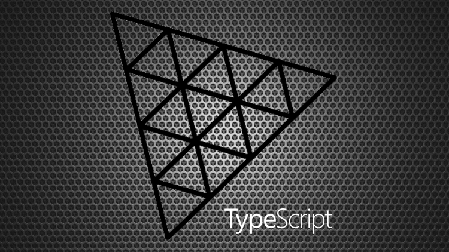

# ButtonVR

A minimal button for use in VR.

Triggered just by looking at it. 

It uses 3D objects as buttons.

You can download the project and view the examples.

``` bash
git clone https://github.com/Sean-Bradley/ButtonVR.git
cd ButtonVR
npm install
npm run dev
```

Visit http://127.0.0.1:3000/


## How to import ButtonVR

You can copy the generated `./dist/client/buttonvr.js` directly into your own project folder and import as a module.

``` html
<script type="module" src="./buttonvr.js"></script>
```

or as relative ES6 import

``` javascript
import ButtonVR from './buttonvr.js'
```

or if using a bundler such as webpack or rollup

``` javascript
import ButtonVR from 'buttonvr'
```

> Note
If using a bundler, you will need to update the **import** reference in your copy of `buttonvr.js`. By default it is set to ```import * as THREE from '/build/three.module.js'```. Try setting it to ```import * as THREE from 'three'```

## Instantiate And Use

Pass in an existing *THREE.Scene*, *THREE.Camera* and optional milliseconds duration to look at the button until it fires the **pressed** event. (Default 1000 milliseconds)

``` javascript
const buttonVR = new ButtonVR(scene, camera)
```

or

``` javascript
const buttonVR = new ButtonVR(scene, camera, 500) //wait 500 millisecinds to decide if button is pressed. (Default 1000ms)
```

Create your Object3D, give it a name, add it to scene, and add it to the ButtonVR buttons list.

``` javascript
const box = new THREE.Mesh(
    new THREE.BoxBufferGeometry(1, 1, 1),
    new THREE.MeshBasicMaterial({
        color: 0xff0066,
        wireframe: true
    })
)
box.name = "box"
box.position.set(-2, .5, -4)
scene.add(box)
buttonVR.buttons.push(box)
```

Update ButtonVR in your render loop just before rendering your scene.

``` javascript
buttonVR.update(renderer)
renderer.render(scene, camera)
```

## ButtonVR Events

When you look at an object, the **pressedStart** start event fires, and the countdown begins.

``` javascript
buttonVR.addEventListener("pressedStart", (intersection: THREE.Intersection) => {
    console.log("pressedStart")
})
```

After the countdown duration (default 1 second), the **pressed** event fires. The countdown timer continues to increase only if you continue to look at the object.

``` javascript
buttonVR.addEventListener("pressed", (intersection: THREE.Intersection) => {
    console.log("pressed")
})
```

When you stop looking at an object, the **pressedEnd** event fires. 

``` javascript
buttonVR.addEventListener("pressedEnd", () => {
    console.log("pressedEnd")
})
```


## Example 1

Basic ButtonVR demo.

[](https://sbcode.net/threejs/buttonvr-1/)

## Example 2

Basic ButtonVR demo 2.

[](https://sbcode.net/threejs/buttonvr-2/)

## ButtonVR Source Project

This is a TypeScript project consisting of two sub projects with there own *tsconfigs*.

To edit this example, then modify the files in `./src/client/` or `./src/server/`

The projects will auto recompile if you started it by using *npm run dev*

## Threejs TypeScript Course

Visit https://github.com/Sean-Bradley/Three.js-TypeScript-Boilerplate for a Threejs TypeScript boilerplate containing many extra branches that demonstrate many examples of Threejs.

> To help support this Threejs example, please take a moment to look at my official Threejs TypeScript course at 

[](https://www.udemy.com/course/threejs-tutorials/?referralCode=4C7E1DE91C3E42F69D0F)

  [Three.js and TypeScript](https://www.udemy.com/course/threejs-tutorials/?referralCode=4C7E1DE91C3E42F69D0F)<br/>  
  Discount Coupons for all my courses can be found at [https://sbcode.net/coupons](https://sbcode.net/coupons)
